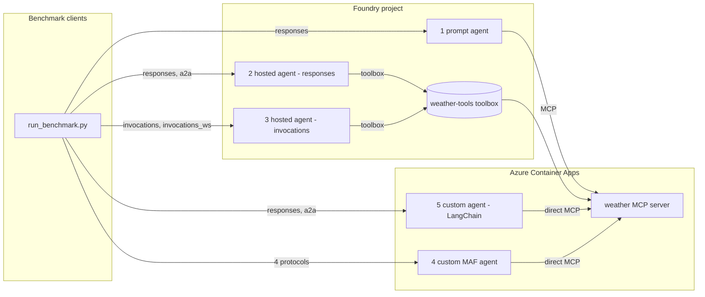

# Foundry performance measurement

BeMad framework

A benchmark for comparing how **weather agents** behave across different hosting
formats and protocols in [Microsoft Foundry](https://learn.microsoft.com/azure/ai-foundry/).
It measures, per protocol and per hosting model:

- **latency** (mean / p50 / p95),
- **time to first streamed token** (TTFB),
- **start-up time** for a new agent (cold start),
- **first request vs. follow-up request** on an existing session.

The scenario is deliberately simple: every agent answers weather questions using
a single **weather MCP server** (random data, no auth). What changes between the
variations is *where the agent runs* and *how it reaches the tool*.

## Protocols under test

| protocol         | transport        | endpoint                    |
|------------------|------------------|-----------------------------|
| responses        | HTTP + SSE       | `POST /responses`           |
| responses-store  | HTTP + SSE       | `POST /responses` (`store=true`) |
| invocations      | HTTP             | `POST /invocations`         |
| invocations_ws   | WebSocket        | `/invocations_ws`           |
| a2a              | HTTP (JSON-RPC)  | `POST /a2a` or `/a2a/{assistant_id}` |

`invocations_ws` is a Foundry public-preview feature available **only in North
Central US**, so provision in `northcentralus`.

## The five agent variations

| # | variation                     | hosting                         | protocol(s)                          | tool access                     | code |
|---|-------------------------------|----------------------------------|---------------------------------------|----------------------------------|------|
| 1 | **prompt agent**              | Foundry-native (no container)    | responses, responses-store, a2a, invocations | selectable MCP route           | `scripts/deploy_prompt_agent.py` |
| 2 | **hosted agent (responses)**  | Foundry-hosted **container**    | responses, responses-store, a2a (fronted by Foundry) | selectable MCP route           | `src/hosted_agent_responses/` |
| 3 | **hosted agent (invocations)**| Foundry-hosted **container**    | invocations, invocations_ws          | selectable MCP route           | `src/hosted_agent_invocations/` |
| 4 | **custom MAF agent**          | Azure Container App (outside Foundry) | responses, invocations, invocations_ws, a2a | selectable MCP route | `src/custom_agent_maf/` |
| 5 | **custom agent (LangChain)**  | Azure Container App (outside Foundry) | responses, a2a | selectable MCP route | `src/custom_agent_langchain/` |

Each Agent Framework hosted agent (2, 3) implements a **single, native** `azure-ai-agentserver`
protocol host — no protocol composition, no shared code between the two. The
responses variation (2) doesn't carry its own A2A server: Foundry fronts A2A
natively for hosted agents that implement the responses protocol (see
[enable incoming A2A](https://learn.microsoft.com/azure/foundry/agents/how-to/enable-agent-to-agent-endpoint)).
The custom MAF agent (4) composes four protocols in one container around one
Microsoft Agent Framework agent. Responses uses
`agent-framework-hosting-responses`, Invocations and WebSocket use app-owned
routes, and A2A uses `agent-framework-a2a` with the official A2A SDK. Comparing
it to variations 2/3 isolates the cost of Foundry hosting and the toolbox from
the agent logic itself.

The LangChain sample (5) uses `langchain-mcp-adapters` to load weather tools
directly, LangChain `create_agent` to compile the LangGraph agent, an app-owned
Responses route, and current LangGraph Agent Server's built-in A2A endpoint at
`/a2a/weather-agent`. The custom ACA agents run outside Foundry hosting; Foundry
supplies model inference and telemetry registration only.

Variation 5 uses Agent Server's in-memory development runtime because this
benchmark deploys one standalone Container App without Redis or PostgreSQL. A
production standalone Agent Server requires LangChain's backing services and
license. Agent Server keeps its native LangSmith/OTLP tracing; its OpenTelemetry
1.37 dependency is currently incompatible with the Azure Monitor distro used by
the other variations.



## Repository layout

```
src/
  weather_mcp_server/     FastMCP weather tools — random data, no auth
  hosted_agent_responses/  variation 2 — self-contained, native ResponsesAgentServerHost only; a2a fronted natively by Foundry + Dockerfile (tool via toolbox)
  hosted_agent_invocations/ variation 3 — self-contained, native InvocationAgentServerHost only (invocations + invocations_ws) + Dockerfile (tool via toolbox)
  custom_agent_maf/       variation 4 — native Microsoft Agent Framework multi-protocol host + Dockerfile (direct MCP)
  custom_agent_langchain/ variation 5 — Agent Server A2A + custom Responses route + Dockerfile (direct MCP)
  custom_agent_harness/   interactive plan-and-execute console (direct MCP)
  clients/                benchmark clients (one per protocol) + run_benchmark.py
scripts/                build / deploy / register / cleanup scripts
                        run_benchmark_sandbox.py runs benchmark batches in an ACA sandbox
infra/                  bicep: Foundry + ACR + Container Apps + monitoring
                        core/network/  private endpoints + private DNS (private mode)
```

## Prerequisites

- [Azure Developer CLI](https://aka.ms/azd) (`azd`) and [Azure CLI](https://learn.microsoft.com/cli/azure/) (`az`)
- Python 3.13+
- An Azure subscription with quota for the chat model in your region
- `pip install -r requirements.txt` for deployment and shared local tooling
- `pip install -r src/custom_agent_langchain/requirements.txt` to run variation 5 locally
- `pip install -r src/custom_agent_harness/requirements.txt` to run the harness console

## Deploy

1. **Provision** Foundry, ACR, Container Apps, and monitoring:

   ```bash
   azd up
   ```

   `azd up` asks for the environment name, region, subscription, and
   **`enablePrivateNetworking`** — set it to `true` to deploy the Foundry agent
   service into the private virtual network (see
   [Private networking](#private-networking)). Pre-answer it non-interactively
   with `azd env set ENABLE_PRIVATE_NETWORKING false`.

   Outputs are written to `.env` (the `azure.yaml` postdeploy hook copies them
   to the repo root). See `.env.sample` for every variable.

2. **Deploy the tool and agents** (preview Foundry operations, run explicitly):

   ```bash
   python -m scripts.build_containers                    # build all images in ACR
   python -m scripts.deploy_weather_mcp_server           # MCP server → Container App
   python -m scripts.register_weather_toolbox            # wrap MCP server in a toolbox
   python -m scripts.deploy_prompt_agent                 # variation 1
   python -m scripts.deploy_hosted_agent_responses       # variation 2
   python -m scripts.deploy_hosted_agent_invocations     # variation 3
   python -m scripts.deploy_custom_agent_maf             # variation 4
   python -m scripts.deploy_custom_agent_langchain       # variation 5
   ```

  All agents use the MCP server directly by default. To measure toolbox
  overhead, set `WEATHER_TOOL_MODE=toolbox` before deploying the agents. The
  accepted values are `direct` and `toolbox`; changing the value requires an
  agent redeploy. The effective mode is saved per agent in `.env`.

   Each script records what it created back into `.env` (URLs, agent names) for
   the next step and for the benchmark clients.

  Hosted and custom agent containers use the Foundry project model endpoint by
  default. To route model inference directly to Azure OpenAI instead, set:

  ```dotenv
  AZURE_AI_ENDPOINT_TYPE=openai
  AZURE_OPENAI_API_VERSION=2025-04-01-preview
  ```

  The Azure OpenAI base URL is derived from `AZURE_AI_PROJECT_ENDPOINT`; for
  example, `https://<account>.services.ai.azure.com/api/projects/<project>`
  becomes `https://<account>.openai.azure.com/openai/v1/`.

  Both modes use `DefaultAzureCredential`. Foundry mode requests
  `https://ai.azure.com/.default`; direct mode requests
  `https://cognitiveservices.azure.com/.default`. Hosted toolbox calls remain
  on the Foundry scope in either mode.

  Per-replica CPU and memory are configurable in `.env` before deployment:

  ```dotenv
  HOSTED_AGENT_CPU=2
  HOSTED_AGENT_MEMORY=4Gi
  CUSTOM_AGENT_CPU=2
  CUSTOM_AGENT_MEMORY=4.0Gi
  ```

See [AGENTS.md](AGENTS.md) for the full operational runbook (rebuild, redeploy,
update, troubleshoot, tear down).

## Private networking

`enablePrivateNetworking=true` (asked during `azd up`, stored as
`ENABLE_PRIVATE_NETWORKING`) provisions the same benchmark, but with the
Foundry agent service network injected — modelled on the Foundry
[17-private-network-standard-user-assigned-identity-agent-setup](https://github.com/microsoft-foundry/foundry-samples/tree/main/infrastructure/infrastructure-setup-bicep/17-private-network-standard-user-assigned-identity-agent-setup)
sample:

| what | public (default) | private |
|------|------------------|---------|
| AI Services account | `publicNetworkAccess: Enabled` | `Disabled`, `networkAcls.defaultAction: Deny` (bypass `AzureServices`) |
| agent runtime | Microsoft-managed network | injected into `agent-subnet` (`networkInjections`, `scenario: agent`) |
| account capability host | public hosting environment | `customerSubnet` = `agent-subnet` |
| reachability | any client with a token | private endpoint + private DNS only |

The VNet (`10.0.0.0/19`) always carries four subnets so the two modes stay
comparable: `gateway`, `pe-subnet` (private endpoints), `agent-subnet`
(delegated to Foundry only in private mode), `sandbox-subnet` (ACA sandbox) and
`aca-apps` (Container Apps environment). Private mode additionally creates
private endpoints and private DNS zones
(`privatelink.services.ai.azure.com`, `privatelink.openai.azure.com`,
`privatelink.cognitiveservices.azure.com`, `privatelink.blob.core.windows.net`).

Once private, the Foundry endpoint is unreachable from your workstation. Run
the deploy scripts before flipping the switch, and benchmark from the sandbox
(below), which joins `sandbox-subnet`.

## Hosted hypothesis workflow

The repository also contains a separate, non-benchmark hosted agent in
`src/hosted_hypothesis_agent/`. It formulates a hypothesis, creates a harness
plan, waits for approval of the exact plan revision and digest, then resumes the
same logical harness session in execute mode. Workflow and approval state are
stored in the provisioned Azure Blob Storage account with optimistic concurrency.

Configure three read-only MCP services in `.env`, register them as Foundry
toolboxes, then deploy the agent:

```dotenv
INTERNET_RESEARCH_MCP_URL=https://<internet-research-service>/mcp
CONTEXT_API_MCP_URL=https://<context-api-service>/mcp
DOCUMENT_SEARCH_MCP_URL=https://<document-search-service>/mcp
```

For a test deployment, leave any of these three values unset. The registration
script uses `WEATHER_MCP_URL` as its fallback, so all logical tool categories can
temporarily target the existing weather MCP server.

```bash
python -m scripts.register_hypothesis_toolboxes
python -m scripts.deploy_hosted_hypothesis_agent
```

Start a workflow and approve the returned revision and digest in a second call:

```bash
python -m scripts.invoke_hypothesis_agent plan "Investigate the working scenario"
python -m scripts.invoke_hypothesis_agent decide <workflow-id> <revision> <sha256:digest> approved
python -m scripts.invoke_hypothesis_agent status <workflow-id>
```

The Foundry gateway must forward an authenticated caller identity in
`x-ms-client-object-id`, `x-ms-client-principal-id`, or
`x-ms-client-principal-name`. The agent fails closed when no caller identity is
available. `ALLOW_INSECURE_LOCAL_CALLER=true` is provided only for local tests.

## Run the benchmark

`--agent` picks the variation; the base URL(s) and the right auth mode are
derived automatically from `.env` (loaded by the script itself — no need to
`source .env` first). `--protocols` narrows to a subset (default `all`, scoped
to whatever that variation supports — see the table above).

`responses-store` is a second configuration of the Responses API for the
Foundry-managed prompt and hosted-responses agents. It explicitly sends
`store=true`, captures the returned response ID, and sends it as
`previous_response_id` on the follow-up turn. The regular `responses`
configuration continues to reuse `agent_session_id`, so running both labels
compares API-managed response chaining with agent-session state.

```bash
# 1. prompt agent — Foundry-native, responses + a2a + invocations
python -m src.clients.run_benchmark --agent prompt --protocols a2a,responses --model-hosting foundry --iterations 5

# Compare agent-session state with stored Responses API chaining
python -m src.clients.run_benchmark --agent prompt --protocols responses,responses-store --model-hosting foundry --iterations 5

# 2. hosted agent, responses variation — responses + a2a (fronted natively by Foundry)
python -m src.clients.run_benchmark --agent hosted-responses --protocols a2a,responses --model-hosting foundry --iterations 5
python -m src.clients.run_benchmark --agent hosted-responses --protocols a2a,responses --model-hosting openai --iterations 5

# 3. hosted agent, invocations variation — invocations + invocations_ws
python -m src.clients.run_benchmark --agent hosted-invocations --protocols all --model-hosting foundry --iterations 5
python -m src.clients.run_benchmark --agent hosted-invocations --protocols all --model-hosting openai --iterations 5

# 4. custom MAF agent — Container App, four protocols directly
python -m src.clients.run_benchmark --agent custom-maf --protocols a2a,responses --model-hosting foundry --iterations 5
python -m src.clients.run_benchmark --agent custom-maf --protocols a2a,responses --model-hosting openai --iterations 5

# 5. custom LangChain agent — Container App, responses + a2a directly
python -m src.clients.run_benchmark --agent custom-langchain --protocols a2a,responses --model-hosting foundry --iterations 5
python -m src.clients.run_benchmark --agent custom-langchain --protocols a2a,responses --model-hosting openai --iterations 5

```

### Batch runs from an Azure Container Apps sandbox

`scripts.run_benchmark_sandbox` runs the same benchmark from a disposable
[ACA sandbox](https://sandboxes.azure.com/docs/sandboxes/sandbox/vnet) instead
of your workstation, so latency is measured from inside Azure — and, in private
mode, from inside the VNet. One invocation is a batch: it boots the sandbox,
downloads this repository into it, installs `src/clients/requirements.txt`,
runs one `run_benchmark` per agent/protocol combination, and downloads every
result file afterwards.

```bash
# every deployed variation, all protocols each, 20 iterations
python -m scripts.run_benchmark_sandbox \
  --agents all --protocols all --model-hosting foundry --iterations 20

# a subset, results in a named directory, sandbox kept for inspection
python -m scripts.run_benchmark_sandbox \
  --agents custom-maf,hosted-responses --protocols responses,a2a \
  --model-hosting openai --iterations 10 \
  --results-dir results/batch-01 --keep-sandbox
```

Required flags mirror the local runner: `--agents`, `--protocols`,
`--model-hosting`, `--iterations`. Results land in
`results/sandbox-<UTC timestamp>/` (one `benchmark-<agent>.json` per run, plus
`batch-summary.json` with the exit code of every run).

Networking follows `--network`:

- `auto` (default) — VNet-joined when `AZURE_PRIVATE_NETWORKING=true`, public otherwise.
- `private` — the sandbox group gets a VNet connection to `sandbox-subnet`, so
  agents are reached over private endpoints. The Entra token for Foundry
  endpoints is written to the sandbox `.env` (`AZURE_AI_ACCESS_TOKEN`) because
  that traffic does not pass the egress proxy.
- `public` — agents are reached through the ACA egress proxy. The proxy runs a
  deny-by-default policy that whitelists only GitHub/PyPI (bootstrap) plus the
  hosts of every agent, MCP and toolbox endpoint in `.env`; add more with
  `--egress-allow host1,host2`. The Foundry `Authorization` header is injected
  by the proxy, so no token is ever written into the sandbox.

The injected token is not refreshed, so keep single batches under an hour.
Sandboxes require the `Container Apps SandboxGroup Data Owner` role, which the
script grants to the signed-in user if it is missing.

## Run the harness console

The Agent Framework harness is an interactive local console, not a hosted
benchmark variation. It starts in plan mode and connects directly to the weather
MCP server. Use `/mode execute` after approving its plan.

```bash
pip install -r src/custom_agent_harness/requirements.txt
WEATHER_MCP_URL="$WEATHER_MCP_URL" python -m src.custom_agent_harness.agent
```

It reads `AZURE_AI_PROJECT_ENDPOINT` and `AZURE_AI_MODEL_DEPLOYMENT_NAME` from
`.env` and authenticates with `AzureCliCredential`, so run `az login` first.

Other options, including pointing at an arbitrary URL directly with
`--base-url` (bypasses `--agent`/`.env` derivation — useful for a local
process; add `--auth entra` if that URL is still Entra ID–protected):

```bash
python -m src.clients.run_benchmark \
  --base-url http://127.0.0.1:8088 \
  --protocols responses,invocations_ws \
  --model-hosting foundry \
  --iterations 20 \
  --out results.json
```

`--model-hosting {foundry,openai}` is mandatory and records which model
inference endpoint the deployed agent uses. Every invocation writes one JSON
artifact. By default the path is
`results/benchmark-<UTC timestamp>.json`; use `--out` to override it.

The artifact contains its UTC `datetime`, run metadata, raw turns, and a
comparison-ready `results` array. Each result row contains `agent-type`,
`protocol`, `phase`, `model-hosting`, `model-deployment`, `tool-mode`, `n`, `err`,
`mean-ms`, `p50`, `p95`, and mean `ttfb`, with all timings in milliseconds.
`phase` distinguishes cold, warm, and follow-up measurements.

Example output:

```
protocol        phase        n  err   mean ms    p50 ms    p95 ms   ttfb ms
---------------------------------------------------------------------------
responses       cold         1    0      1850      1850      1850       420
responses       warm        10    0       540       520       690       120
responses       followup    10    0       480       470       610       105
invocations_ws  warm        10    0       560       540       700       118
...
```

The Foundry-native responses variations (1 and 2) are invoked through the
Foundry Responses endpoint via `AIProjectClient.get_openai_client(agent_name=...)`,
which builds `base_url` as `{AZURE_AI_PROJECT_ENDPOINT}/agents/{agent_name}/endpoint/protocols/openai`
(see `scripts/deploy_prompt_agent.py`). The hosted invocations variation (3) is
invoked through the analogous `.../endpoint/protocols` path for that agent
instead — `run_benchmark.py`'s `--agent` builds both URL shapes for you.

> **Auth note:** the Foundry agent endpoints above are Entra ID–protected
> (bearer token, scope `https://ai.azure.com/.default`) — unlike the anonymous
> MCP server/toolbox/custom Container Apps. `--auth` defaults to `auto`,
> which picks `entra` for `prompt`/`hosted-responses`/`hosted-invocations` and
> `none` for the custom ACA agents, attaching a token from `DefaultAzureCredential` (the
> same credential used by `az login`/`azd auth login`) when needed. Override
> with `--auth entra`/`--auth none` if you need to force one or the other
> (e.g. alongside `--base-url`).

## No authentication

Per the scenario, the MCP server, the containers, and the toolbox all run
**anonymous** to keep the connection as fast as possible. Do not use this setup
as-is for anything with real data.

## Telemetry

Every component activates Application Insights instrumentation when
`APPLICATIONINSIGHTS_CONNECTION_STRING` is set (injected by Foundry for hosted
agents, passed by the deploy scripts to the Container Apps), so agent runs, tool
calls, and protocol handling are traceable end to end.

## Clean up

```bash
python -m scripts.delete_agents   # remove Foundry agents + toolbox
azd down                          # remove all Azure resources
```

Sandbox groups live outside the azd deployment; delete one when you are done
benchmarking:

```bash
az resource delete --resource-group "$AZURE_RESOURCE_GROUP" \
  --resource-type Microsoft.App/sandboxGroups --name "sbx-$AZURE_ENV_NAME"
```
