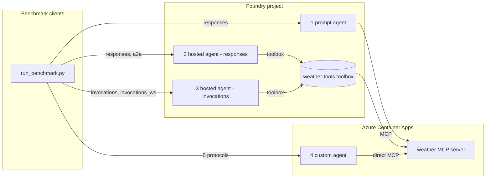

# Foundry performance measurement

A benchmark for comparing how **weather agents** behave across different hosting
formats and protocols in [Microsoft Foundry](https://learn.microsoft.com/azure/ai-foundry/).
It measures, per protocol and per hosting model:

- **latency** (mean / p50 / p95),
- **time to first streamed token** (TTFB),
- **start-up time** for a new agent (cold start),
- **first request vs. follow-up request** on an existing session.

The scenario is deliberately simple: every agent answers weather questions using
a single **weather MCP server** (random data, no auth). What changes between the
variations is *where the agent runs* and *how it reaches the tool*.

## Protocols under test

| protocol         | transport        | endpoint                    |
|------------------|------------------|-----------------------------|
| responses        | HTTP + SSE       | `POST /responses`           |
| invocations      | HTTP             | `POST /invocations`         |
| invocations_ws   | WebSocket        | `/invocations_ws`           |
| a2a              | HTTP (JSON-RPC)  | `POST /a2a`                 |
| activity         | HTTP             | `POST /activity/messages`   |

`invocations_ws` is a Foundry public-preview feature available **only in North
Central US**, so provision in `northcentralus`.

## The four agent variations

| # | variation                     | hosting                         | protocol(s)                          | tool access                     | code |
|---|-------------------------------|----------------------------------|---------------------------------------|----------------------------------|------|
| 1 | **prompt agent**              | Foundry-native (no container)    | responses                            | inline MCP tool → MCP server    | `scripts/deploy_prompt_agent.py` |
| 2 | **hosted agent (responses)**  | Foundry-hosted **container**    | responses, a2a (fronted by Foundry)  | **Foundry toolbox** → MCP server| `src/hosted_agent_responses/` |
| 3 | **hosted agent (invocations)**| Foundry-hosted **container**    | invocations, invocations_ws          | **Foundry toolbox** → MCP server| `src/hosted_agent_invocations/` |
| 4 | **custom agent**              | Azure Container App (outside Foundry) | responses, invocations, invocations_ws, a2a, activity | **direct** MCP URL (no toolbox) | `src/custom_agent/` |

Each hosted agent (2, 3) implements a **single, native** `azure-ai-agentserver`
protocol host — no protocol composition, no shared code between the two. The
responses variation (2) doesn't carry its own A2A server: Foundry fronts A2A
natively for hosted agents that implement the responses protocol (see
[enable incoming A2A](https://learn.microsoft.com/azure/foundry/agents/how-to/enable-agent-to-agent-endpoint)).
The custom agent (4) still composes all five protocols in one container so it
can be exercised end to end by the full benchmark client suite; comparing it to
variations 2/3 isolates the cost of Foundry hosting and the toolbox from the
agent logic itself.



## Repository layout

```
src/
  weather_mcp_server/     FastMCP weather tools — random data, no auth
  hosted_agent_responses/  variation 2 — self-contained, native ResponsesAgentServerHost only; a2a fronted natively by Foundry + Dockerfile (tool via toolbox)
  hosted_agent_invocations/ variation 3 — self-contained, native InvocationAgentServerHost only (invocations + invocations_ws) + Dockerfile (tool via toolbox)
  custom_agent/           variation 4 — self-contained (runner, telemetry, multi-protocol host, a2a) + Dockerfile (direct MCP)
  clients/                benchmark clients (one per protocol) + run_benchmark.py
scripts/                build / deploy / register / cleanup scripts
infra/                  bicep: Foundry + ACR + Container Apps + monitoring
```

## Prerequisites

- [Azure Developer CLI](https://aka.ms/azd) (`azd`) and [Azure CLI](https://learn.microsoft.com/cli/azure/) (`az`)
- Python 3.13+
- An Azure subscription with quota for the chat model in your region
- `pip install -r requirements.txt`

## Deploy

1. **Provision** Foundry, ACR, Container Apps, and monitoring:

   ```bash
   azd up
   ```

   Outputs are written to `.env` (the `azure.yaml` postdeploy hook copies them
   to the repo root). See `.env.sample` for every variable.

2. **Deploy the tool and agents** (preview Foundry operations, run explicitly):

   ```bash
   python -m scripts.build_containers                    # build all images in ACR
   python -m scripts.deploy_weather_mcp_server           # MCP server → Container App
   python -m scripts.register_weather_toolbox            # wrap MCP server in a toolbox
   python -m scripts.deploy_prompt_agent                 # variation 1
   python -m scripts.deploy_hosted_agent_responses       # variation 2
   python -m scripts.deploy_hosted_agent_invocations     # variation 3
   python -m scripts.deploy_custom_agent                 # variation 4
   ```

   Each script records what it created back into `.env` (URLs, agent names) for
   the next step and for the benchmark clients.

See [AGENTS.md](AGENTS.md) for the full operational runbook (rebuild, redeploy,
update, troubleshoot, tear down).

## Run the benchmark

`--agent` picks the variation; the base URL(s) and the right auth mode are
derived automatically from `.env` (loaded by the script itself — no need to
`source .env` first). `--protocols` narrows to a subset (default `all`, scoped
to whatever that variation supports — see the table above).

```bash
# 1. prompt agent — Foundry-native, responses only
python -m src.clients.run_benchmark --agent prompt --protocols all --iterations 5

# 2. hosted agent, responses variation — responses + a2a (fronted natively by Foundry)
python -m src.clients.run_benchmark --agent hosted-responses --protocols all --iterations 5
python -m src.clients.run_benchmark --agent hosted-responses --protocols a2a --iterations 5

# 3. hosted agent, invocations variation — invocations + invocations_ws
python -m src.clients.run_benchmark --agent hosted-invocations --protocols invocations --iterations 5

# 4. custom agent — Container App, all five protocols directly
python -m src.clients.run_benchmark --agent custom --protocols a2a,invocations,responses --iterations 5
```

Other options, including pointing at an arbitrary URL directly with
`--base-url` (bypasses `--agent`/`.env` derivation — useful for a local
process; add `--auth entra` if that URL is still Entra ID–protected):

```bash
python -m src.clients.run_benchmark \
  --base-url http://127.0.0.1:8088 \
  --protocols responses,invocations_ws \
  --iterations 20 \
  --out results.json
```

Example output:

```
protocol        phase        n  err   mean ms    p50 ms    p95 ms   ttfb ms
---------------------------------------------------------------------------
responses       cold         1    0      1850      1850      1850       420
responses       warm        10    0       540       520       690       120
responses       followup    10    0       480       470       610       105
invocations_ws  warm        10    0       560       540       700       118
...
```

The Foundry-native responses variations (1 and 2) are invoked through the
Foundry Responses endpoint via `AIProjectClient.get_openai_client(agent_name=...)`,
which builds `base_url` as `{AZURE_AI_PROJECT_ENDPOINT}/agents/{agent_name}/endpoint/protocols/openai`
(see `scripts/deploy_prompt_agent.py`). The hosted invocations variation (3) is
invoked through the analogous `.../endpoint/protocols` path for that agent
instead — `run_benchmark.py`'s `--agent` builds both URL shapes for you.

> **Auth note:** the Foundry agent endpoints above are Entra ID–protected
> (bearer token, scope `https://ai.azure.com/.default`) — unlike the anonymous
> MCP server/toolbox/custom-agent Container App. `--auth` defaults to `auto`,
> which picks `entra` for `prompt`/`hosted-responses`/`hosted-invocations` and
> `none` for `custom`, attaching a token from `DefaultAzureCredential` (the
> same credential used by `az login`/`azd auth login`) when needed. Override
> with `--auth entra`/`--auth none` if you need to force one or the other
> (e.g. alongside `--base-url`).

## No authentication

Per the scenario, the MCP server, the containers, and the toolbox all run
**anonymous** to keep the connection as fast as possible. Do not use this setup
as-is for anything with real data.

## Telemetry

Every component activates Application Insights instrumentation when
`APPLICATIONINSIGHTS_CONNECTION_STRING` is set (injected by Foundry for hosted
agents, passed by the deploy scripts to the Container Apps), so agent runs, tool
calls, and protocol handling are traceable end to end.

## Clean up

```bash
python -m scripts.delete_agents   # remove Foundry agents + toolbox
azd down                          # remove all Azure resources
```
