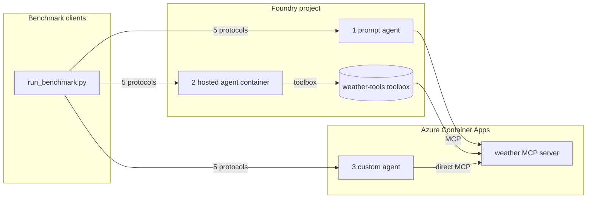

# Foundry performance measurement

A benchmark for comparing how **weather agents** behave across different hosting
formats and protocols in [Microsoft Foundry](https://learn.microsoft.com/azure/ai-foundry/).
It measures, per protocol and per hosting model:

- **latency** (mean / p50 / p95),
- **time to first streamed token** (TTFB),
- **start-up time** for a new agent (cold start),
- **first request vs. follow-up request** on an existing session.

The scenario is deliberately simple: every agent answers weather questions using
a single **weather MCP server** (random data, no auth). What changes between the
variations is *where the agent runs* and *how it reaches the tool*.

## Protocols under test

| protocol         | transport        | endpoint                    |
|------------------|------------------|-----------------------------|
| responses        | HTTP + SSE       | `POST /responses`           |
| invocations      | HTTP             | `POST /invocations`         |
| invocations_ws   | WebSocket        | `/invocations_ws`           |
| a2a              | HTTP (JSON-RPC)  | `POST /a2a`                 |
| activity         | HTTP             | `POST /activity/messages`   |

`invocations_ws` is a Foundry public-preview feature available **only in North
Central US**, so provision in `northcentralus`.

## The three agent variations

| # | variation        | hosting                         | tool access                     | code |
|---|------------------|---------------------------------|---------------------------------|------|
| 1 | **prompt agent** | Foundry-native (no container)   | inline MCP tool → MCP server    | `scripts/deploy_prompt_agent.py` |
| 2 | **hosted agent** | Foundry-hosted **container**    | **Foundry toolbox** → MCP server| `src/hosted_agent/` |
| 3 | **custom agent** | Azure Container App (outside Foundry) | **direct** MCP URL (no toolbox) | `src/custom_agent/` |

Variations 2 and 3 run the **same** container code (Microsoft Agent Framework +
`azure-ai-agentserver` multi-protocol host, native A2A serving). The only
differences are the hosting plane and whether the weather tool is reached via
the Foundry toolbox or directly. That isolates the cost of the toolbox and of
Foundry hosting from the agent logic itself.



## Repository layout

```
src/
  weather_mcp_server/   FastMCP weather tools — random data, no auth
  agent_common/         shared: runner, telemetry, multi-protocol host, a2a app
  hosted_agent/         variation 2 entrypoint + Dockerfile (tool via toolbox)
  custom_agent/         variation 3 entrypoint + Dockerfile (direct MCP)
  clients/              benchmark clients (one per protocol) + run_benchmark.py
scripts/                build / deploy / register / cleanup scripts
infra/                  bicep: Foundry + ACR + Container Apps + monitoring
```

## Prerequisites

- [Azure Developer CLI](https://aka.ms/azd) (`azd`) and [Azure CLI](https://learn.microsoft.com/cli/azure/) (`az`)
- Python 3.13+
- An Azure subscription with quota for the chat model in your region
- `pip install -r requirements.txt`

## Deploy

1. **Provision** Foundry, ACR, Container Apps, and monitoring:

   ```bash
   azd up
   ```

   Outputs are written to `.env` (the `azure.yaml` postdeploy hook copies them
   to the repo root). See `.env.sample` for every variable.

2. **Deploy the tool and agents** (preview Foundry operations, run explicitly):

   ```bash
   python -m scripts.build_containers            # build all images in ACR
   python -m scripts.deploy_weather_mcp_server   # MCP server → Container App
   python -m scripts.register_weather_toolbox    # wrap MCP server in a toolbox
   python -m scripts.deploy_prompt_agent         # variation 1
   python -m scripts.deploy_hosted_agent         # variation 2
   python -m scripts.deploy_custom_agent         # variation 3
   ```

   Each script records what it created back into `.env` (URLs, agent names) for
   the next step and for the benchmark clients.

See [AGENTS.md](AGENTS.md) for the full operational runbook (rebuild, redeploy,
update, troubleshoot, tear down).

## Run the benchmark

The custom agent (variation 3) exposes all five protocols directly, so the
clients exercise every transport against it:

```bash
python -m src.clients.run_benchmark --base-url "$WEATHER_CUSTOM_AGENT_URL"
```

Options:

```bash
python -m src.clients.run_benchmark \
  --base-url http://127.0.0.1:8088 \
  --protocols responses,invocations_ws \
  --iterations 20 \
  --out results.json
```

Example output:

```
protocol        phase        n  err   mean ms    p50 ms    p95 ms   ttfb ms
---------------------------------------------------------------------------
responses       cold         1    0      1850      1850      1850       420
responses       warm        10    0       540       520       690       120
responses       followup    10    0       480       470       610       105
invocations_ws  warm        10    0       560       540       700       118
...
```

The Foundry-native variations (1 and 2) are invoked through the Foundry
Responses endpoint via `AIProjectClient.get_openai_client(agent_name=...)`, which
handles auth and routing. See `scripts/deploy_prompt_agent.py` for the snippet.

## No authentication

Per the scenario, the MCP server, the containers, and the toolbox all run
**anonymous** to keep the connection as fast as possible. Do not use this setup
as-is for anything with real data.

## Telemetry

Every component activates Application Insights instrumentation when
`APPLICATIONINSIGHTS_CONNECTION_STRING` is set (injected by Foundry for hosted
agents, passed by the deploy scripts to the Container Apps), so agent runs, tool
calls, and protocol handling are traceable end to end.

## Clean up

```bash
python -m scripts.delete_agents   # remove Foundry agents + toolbox
azd down                          # remove all Azure resources
```
