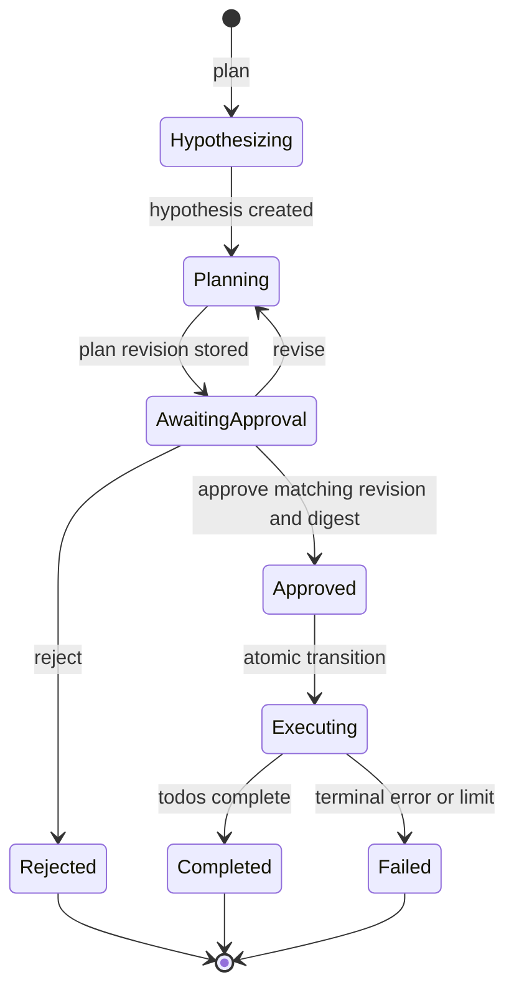

# Plan 01: Hosted Hypothesis and Execution Agent

## 1. Goal

Build a new Microsoft Foundry hosted agent, based on the existing
`hosted_agent_invocations` sample, that is reachable through the Foundry
`invocations` protocol and implements a human-approved plan-and-execute workflow.

The workflow must:

1. Turn the caller's scenario into a testable hypothesis with supporting context
   and guidance.
2. Create an Agent Framework harness session in `plan` mode.
3. Let the harness produce a plan using three distinct Foundry toolbox MCP tool
   categories: internet research, API data-context retrieval, and document search.
4. Return the hypothesis and plan to the caller without performing execution.
5. Resume the same workflow only after the caller explicitly approves the exact
   plan revision.
6. Switch the harness session to `execute` mode and execute the approved plan.
7. Return a structured result containing the hypothesis, approval evidence, plan,
   tool activity, and final executor output.

## 2. Scope and Assumptions

- Add a new self-contained hosted-agent variation. Do not change the behavior of
  the existing weather benchmark agents or turn the local Textual harness into a
  hosted component.
- Use Python and the versions already proven in this repository: Agent Framework,
  Foundry chat client, `azure-ai-agentserver-invocations`, and HTTP MCP tools.
- Register only `invocations` protocol version `2.0.0` for the new hosted agent.
- Use a configured Foundry model deployment; do not hard-code a production model.
- All three domain tools are created and governed as Foundry tools, exposed through
  MCP toolbox endpoints, and called with managed identity. The orchestrator must
  not call their backing services directly.
- Planning may use read-only tools. No side-effecting execution is allowed before
  approval.
- A caller may approve, reject, or request a revision. Approval is never inferred
  from natural-language sentiment alone.

## 3. Proposed Components

### 3.1 Invocations host and workflow orchestrator

Create `src/hosted_hypothesis_agent/agent.py` using
`InvocationAgentServerHost` and an `@app.invoke_handler` route. Replace the
sample's direct `handle_ag_ui_request(agent, request)` delegation with a small
orchestrator that validates the request, loads workflow state, dispatches the
correct phase, and emits protocol-compatible events or a structured error.

The orchestrator owns the state machine. Neither the hypothesis agent nor the
harness may independently decide that approval occurred.

### 3.2 Hypothesis agent

Use a dedicated Agent Framework agent with structured output. Its output schema
should contain:

- `hypothesis_id`
- `statement`: a falsifiable working hypothesis
- `scenario_summary`
- `assumptions`
- `evidence_needed`
- `context`
- `guidance`
- `success_criteria`
- `risks_and_constraints`

The hypothesis agent receives the caller's scenario and may add framing, but it
must distinguish caller-provided facts from assumptions. It then prepares the
planning brief passed to the harness. After a client approval arrives, it validates
that the approved workflow and plan revision match the pending state and produces
an `approval_record`; it does not reinterpret or silently broaden the approval.

### 3.3 Agent harness

Create the harness with `create_harness_agent(...)`, initially call
`set_agent_mode(session, "plan", available_modes=("plan", "execute"))`, and use
the todo loop already proven by `src/custom_agent_harness`.

Inject the scenario, hypothesis, evidence requirements, constraints, and output
contract into the planning prompt. The planning result must be normalized into a
versioned `ExecutionPlan` containing ordered steps, expected tool category per
step, inputs, expected evidence, completion criteria, and risk notes.

On an accepted approval, reload the same logical harness session, call
`set_agent_mode(..., "execute")`, and provide an immutable copy of the approved
plan. Configure `todos_remaining(looping_modes=["execute"])`,
`todos_remaining_message`, and a bounded `loop_max_iterations` so execution cannot
run indefinitely.

### 3.4 Three Foundry toolbox MCP tools

Expose three separately named MCP tools or toolsets to make provenance and policy
boundaries visible:

| Tool | Responsibility | Planning policy | Execution policy |
|---|---|---|---|
| `internet_research` | Current public-web research with source URLs and retrieval timestamps | Read-only, allowed | Read-only, allowed |
| `context_api` | Retrieve structured scenario or business data from an approved API | Schema-constrained reads only | Allowlisted reads; writes disabled unless separately approved in a future scope |
| `document_search` | Search approved enterprise documents/indexes and return document identity plus passages | Read-only, allowed | Read-only, allowed |

Use one authenticated `httpx.AsyncClient` per toolbox endpoint with a fresh
`https://ai.azure.com/.default` token, the
`Foundry-Features: Toolboxes=V1Preview` header, and bounded timeouts. Configure
toolbox names/endpoints through environment variables. Never place service keys
in prompts, workflow state, or container environment when managed identity is
available.

If all tools are published through one toolbox endpoint, still wrap or tag them as
three logical toolsets and enforce an allowlist of expected tool names. Fail startup
or readiness when required tools are missing rather than letting the model invent a
substitute.

### 3.5 Durable workflow state

Do not keep approval or harness continuity only in a process-level dictionary;
Foundry may restart or scale the hosted container. Introduce a `WorkflowStore`
abstraction with an in-memory implementation for unit tests and an Azure-backed
implementation for deployment.

Persist:

- workflow ID, caller/tenant ownership, status, and expiration
- harness session ID and durable provider keys, not a pickled Python object
- hypothesis and hypothesis version
- plan and monotonically increasing plan revision
- cryptographic digest of the canonical plan
- approval decision, approver identity, timestamp, approved revision, and digest
- tool-call audit records and summarized outputs
- final result or terminal error

Configure Agent Framework history, todo, mode, and context providers with durable
storage so `agent.create_session(session_id=...)` can reconstruct the logical
session after a restart. Apply optimistic concurrency to approval and execution
transitions so duplicate invocations cannot execute a plan twice.

## 4. Invocation Contract

Keep control data separate from user prose. Carry it in the invocations/AG-UI
request state or a validated extension object.

### Start or revise planning

```json
{
  "action": "plan",
  "workflow_id": null,
  "scenario": "Caller scenario and constraints",
  "client_request_id": "unique-id"
}
```

Response status is `awaiting_approval` and includes `workflow_id`, hypothesis,
plan, `plan_revision`, `plan_digest`, warnings, and planning-phase tool evidence.

### Approve, reject, or revise

```json
{
  "action": "approve",
  "workflow_id": "workflow-id",
  "plan_revision": 1,
  "plan_digest": "sha256:...",
  "decision": "approved",
  "comment": "Optional bounded comment",
  "client_request_id": "unique-id"
}
```

`decision` is one of `approved`, `rejected`, or `revise`. A revision request
returns to planning and increments `plan_revision`. A stale revision or digest is
rejected with a conflict response. The authenticated caller identity, not an
untrusted body field, is recorded as the approver.

### Poll or retrieve

Support a `status` action so clients can safely recover from network timeouts using
`workflow_id`. Repeated requests with the same `client_request_id` must be
idempotent.

### Final result

Return one stable aggregate envelope:

```json
{
  "workflow_id": "workflow-id",
  "status": "completed",
  "hypothesis": {},
  "plan": {},
  "approval": {},
  "tool_activity": [
    {
      "phase": "planning-or-execution",
      "tool_category": "internet_research-or-context_api-or-document_search",
      "tool_name": "registered-name",
      "started_at": "timestamp",
      "duration_ms": 0,
      "input_summary": {},
      "output_summary": {},
      "citations": []
    }
  ],
  "execution": {
    "completed_steps": [],
    "final_answer": "...",
    "artifacts": [],
    "warnings": []
  },
  "trace_id": "..."
}
```

Do not return secrets, access tokens, hidden model reasoning, or unrestricted raw
document/API payloads. "All tools" means complete audited tool activity with
bounded, policy-filtered summaries and citations.

## 5. Workflow State Machine



Only `Approved -> Executing` enables execute mode. The transition must atomically
record approval before any execution tool call starts.

## 6. Repository Changes

Add these self-contained files and integrations:

1. `src/hosted_hypothesis_agent/__init__.py`
2. `src/hosted_hypothesis_agent/agent.py` for host, orchestration, agents, and
   toolbox construction
3. `src/hosted_hypothesis_agent/models.py` for validated request, hypothesis,
   plan, approval, audit, and result schemas
4. `src/hosted_hypothesis_agent/workflow_store.py` for state transitions,
   idempotency, expiration, and concurrency
5. `src/hosted_hypothesis_agent/Dockerfile`
6. `src/hosted_hypothesis_agent/requirements.txt` with exact compatible pins
7. `scripts/deploy_hosted_hypothesis_agent.py`, cloned from the invocations
   deployment pattern with a distinct image, agent name, environment keys, role
   grants, protocol `2.0.0`, activation polling, and 100% version routing
8. Update `scripts/build_containers.py`, `.env.sample`, `AGENTS.md`, and `README.md`
9. Add focused unit and protocol tests under `tests/hosted_hypothesis_agent/`

Suggested names:

- Foundry agent/image: `scenario-hosted-hypothesis-agent`
- environment keys: `HYPOTHESIS_HOSTED_AGENT_NAME`,
  `HYPOTHESIS_HOSTED_AGENT_IMAGE`, `INTERNET_RESEARCH_TOOLBOX_NAME`,
  `CONTEXT_API_TOOLBOX_NAME`, `DOCUMENT_SEARCH_TOOLBOX_NAME`

## 7. Implementation Sequence

### Phase 1: Contracts and deterministic state machine

1. Define Pydantic schemas and canonical plan hashing.
2. Implement allowed transitions and optimistic concurrency in `WorkflowStore`.
3. Add idempotency, ownership, revision, digest, and expiration checks.
4. Unit-test every transition before introducing model calls.

### Phase 2: Toolbox and agent construction

1. Build authenticated MCP clients using the repository's proven toolbox auth
   pattern.
2. Discover and validate the three required tool categories against allowlists.
3. Build the structured hypothesis agent.
4. Build the harness with durable providers, bounded loops, and explicit modes.

### Phase 3: Invocations orchestration

1. Parse and validate the protocol request.
2. Implement `plan`, `approve`/`reject`/`revise`, and `status` dispatch.
3. Persist the hypothesis and plan before returning `awaiting_approval`.
4. Atomically record matching approval, switch the reconstructed session to
   execute mode, and run only the approved plan.
5. Collect normalized tool events and return the aggregate final envelope.

### Phase 4: Hosting and deployment

1. Add the container, exact dependencies, and readiness behavior.
2. Add the deploy script and managed-identity role grants for the project,
   toolbox resources, document index, data API, and workflow store.
3. Register only the Foundry `invocations` protocol at version `2.0.0`.
4. Build a uniquely tagged image, create a new agent version, wait for `active`,
   and route traffic only after smoke tests pass.

### Phase 5: Client and operations

1. Add a sample client that preserves `workflow_id`, revision, and digest across
   the two calls and authenticates with the Foundry Entra scope.
2. Add OpenTelemetry spans for invocation, hypothesis, planning, approval wait,
   each tool call, each execution step, and finalization.
3. Correlate `trace_id`, Foundry call/run ID, workflow ID, session ID, and client
   request ID without logging sensitive content by default.
4. Document retry, timeout, cancellation, expiration, and operational recovery.

## 8. Security and Reliability Gates

- Use managed identity and least-privilege RBAC for each dependency.
- Validate caller ownership on every continuation call.
- Treat MCP output, web content, API data, and documents as untrusted input;
  prevent retrieved text from changing system policy or approval state.
- Separate read-only planning tools from any future side-effecting tools.
- Bound prompt size, tool output, retries, request duration, todo iterations, and
  workflow lifetime.
- Redact secrets and sensitive payloads from logs and final tool summaries.
- Use plan digest plus revision to prevent approval/execution time-of-check to
  time-of-use changes.
- Make execution idempotent and store terminal results so retries return the prior
  result rather than rerunning tools.
- Fail closed when state, approval, required tools, identity, or provenance cannot
  be verified.

## 9. Validation Plan

### Unit tests

- Structured hypothesis validation and fact/assumption separation
- Canonical plan hashing and revision increments
- Every valid and invalid workflow transition
- Stale, forged, duplicate, rejected, and expired approvals
- Caller ownership and idempotency enforcement
- Tool allowlist and provenance normalization
- Prompt-injection content cannot mutate workflow control state

### Integration tests

- Mock MCP servers prove all three tool categories can be used in planning and
  execution and are attributed correctly.
- A `plan` call creates one harness session in plan mode and performs no execution.
- An approved matching revision resumes that logical session in execute mode.
- Rejection never executes; revision produces a new digest and invalidates prior
  approval.
- Process restart between plan and approval reconstructs state from durable
  providers.
- Concurrent duplicate approvals result in one execution.

### Hosted smoke tests

1. Deploy a new version and wait for `active` before routing traffic.
2. Call the authenticated Foundry endpoint with `?api-version=v1`.
3. Verify the first invocation returns `awaiting_approval` with hypothesis, plan,
   revision, digest, and planning evidence.
4. Approve that exact revision in a second invocation.
5. Verify execution completes once and the final envelope includes all three tool
   categories, hypothesis, approval evidence, plan, executor result, and trace ID.
6. Repeat with reject, revise, stale approval, duplicate request, timeout recovery,
   and container restart cases.

## 10. Definition of Done

- The new agent is independently buildable and deployable without changing an
  existing benchmark variation.
- Foundry exposes it through authenticated `invocations` protocol `2.0.0`.
- No execution occurs before explicit approval of the current plan digest.
- The same logical harness session progresses from plan to execute across separate
  invocations and survives process restart.
- Internet research, context API retrieval, and document search are all reached as
  allowlisted Foundry toolbox MCP tools with auditable provenance.
- The final response contains the hypothesis, approved plan, approval record,
  complete policy-filtered tool audit, execution result, warnings, and trace ID.
- Unit, integration, restart, concurrency, and live hosted smoke tests pass.

## 11. Decisions to Confirm Before Implementation

1. Select the model deployment based on required structured-output quality,
   latency, regional availability, and quota.
2. Name the three existing Foundry tools/toolboxes and document their exact schemas
   and authentication requirements.
3. Choose the durable Agent Framework provider and workflow-store backend available
   in the target environment.
4. Decide whether execution remains read-only for the first release. Adding writes
   requires per-step approval scope, compensating actions, and stricter audit rules.
5. Confirm whether clients require streamed AG-UI events, a final aggregate response,
   or both; keep the same state machine and schemas in either transport form.

## 12. Evidence and Constraints Used

- `src/hosted_agent_invocations/agent.py` demonstrates the native invocations host,
  AG-UI adapter, Foundry/OpenAI model routing, and authenticated toolbox MCP client.
- `scripts/deploy_hosted_agent_invocations.py` demonstrates protocol `2.0.0`, hosted
  image registration, managed-identity role grant, activation polling, and traffic
  routing.
- `src/custom_agent_harness/agent.py` and `console.py` demonstrate harness session
  creation, `plan`/`execute` modes, todo continuation, and explicit mode switching.
- Installed Agent Framework `1.12.1` exposes injectable history, todo, mode, context,
  and file-memory providers plus session-based `get_agent_mode`/`set_agent_mode`.
- Azure AI application guidance favors Agent Framework orchestration, managed
  identity, explicit workflow state, bounded execution, least privilege, and
  end-to-end observability.

The local `architecture-research` skill could not provide additional indexed case
studies because its installed directory contains `SKILL.md` but not the documented
`scripts/search_architecture.py`; no external case-study claims are included here.